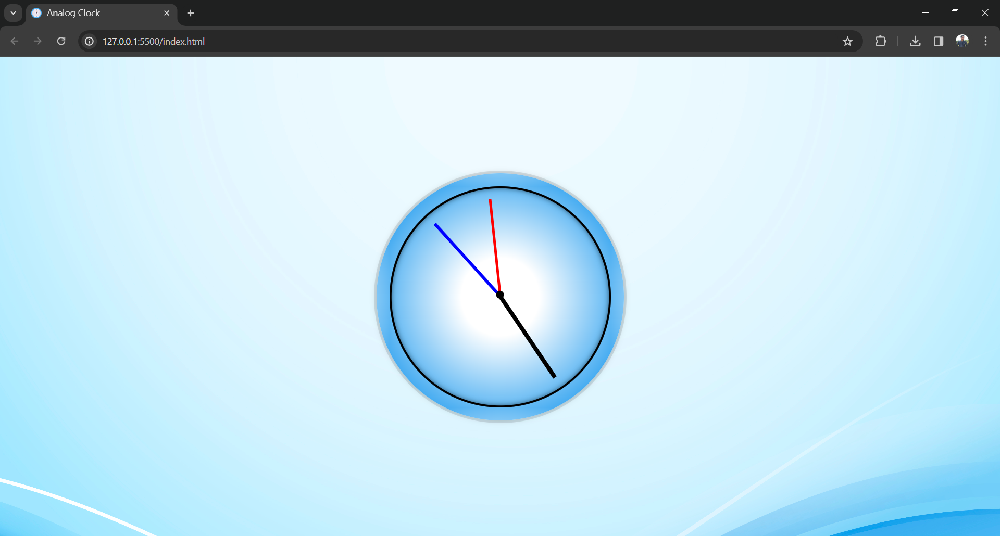

# Analog Clock
Analog Clock is a simple web application that displays the current time in an analog clock format. It is built using HTML, CSS, and JavaScript.

## Preview




## Features

- Real-time display of current time in an analog clock format.
- Smooth animation of clock hands to indicate time change.
- Mouse hover functionality to display the time in 12-hour format.
- Simple and intuitive design.

## Usage

1. Clone the repository:

   ```bash
   git clone https://github.com/AbidKhan01ak/Analog-Clock.git
   
   ```

## Contributing
Contributions are welcome! Feel free to open an issue or submit a pull request for any improvements or bug fixes.

## License
This project is licensed under the MIT License - see the [LICENSE](LICENSE) file for details.
